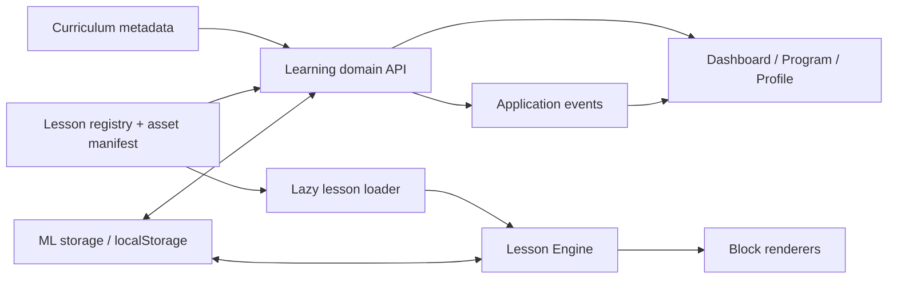

# MathLogic

MathLogic is a local-first mathematics learning application for Russian- and Kazakh-speaking school students. It combines an Algebra and Geometry curriculum with guided lessons, mathematical input, interactive diagrams, progress tracking, and a learning journal.

[Repository](https://github.com/Nurr201/-mathlogic)

## Overview

The project is a static browser application with no build step and no backend. Its curriculum metadata covers grades 7–9, while the currently published lesson set is concentrated in grade 7 with one grade 8 Vieta lesson.

Students can browse the full programme, open available lessons, leave and resume a saved session, and review completed work from the dashboard and profile. All profile and learning data stays in the browser's `localStorage`.

## Features

- Algebra and Geometry programme organised as Subject → Unit → Topic → Lesson
- 40 loadable lesson routes backed by validated lesson configurations
- Config-driven Lesson Engine with resumable block-by-block sessions
- Guided practice, multiple-choice checks, worked examples, hints, and targeted feedback
- Mathematical response input powered by a vendored MathLive build
- Step-based equation practice for configured transformations
- Interactive linear graph activities: point placement, value tables, inspection, and parameter changes
- SVG geometry activities with draggable or keyboard-controlled triangle vertices and configured proof steps
- Dashboard with the next lesson, current topic, subject progress, and recent activity
- Local learning profile with completion metrics, activity calendar, and learning history
- Russian and Kazakh interface and lesson content
- Light, dark, and system themes
- Local profile onboarding, JSON data export, progress reset, and legacy storage migration
- Lazy lesson loading: lesson configs, MathLive, and specialised renderers are loaded only when required

## Screenshots

### Dashboard

<!-- Add dashboard screenshot -->

### Lesson

<!-- Add lesson screenshot -->

### Profile

<!-- Add profile screenshot -->

## Architecture

MathLogic separates the curriculum catalogue from runnable lesson content. `data/curriculum.js` is the canonical source for subjects, units, topics, lesson order, curriculum codes, prerequisites, and production status. `js/data.js` adds runtime metadata only for lessons that have content, while `data/lesson-assets.js` describes how each lesson should be loaded.



Key components:

- **Curriculum** — `data/curriculum.js` contains the grades 7–9 catalogue. `data/program-presentation.js` groups canonical topics into larger student-facing modules without duplicating the curriculum.
- **Lesson registry** — `js/data.js` maps published lesson IDs to routes, localized metadata, duration, and config globals. It also maintains legacy ID mappings.
- **Learning** — `js/learning.js` combines curriculum, registry, progress, and sessions into the API used by the dashboard, programme, profile, and lesson page. It owns completion and reset operations and selects the next lesson.
- **Storage** — `js/storage.js` stores schema-versioned data under `mathlogic_data`, migrates older keys, persists lesson sessions and results, records activity, and exposes export/reset helpers.
- **Lesson loading** — `js/lesson-loader.js` resolves `lesson.html?id=<lesson-id>` and loads the engine, config, MathLive, and specialised primitives on demand.
- **Lesson Engine** — `js/lesson-engine/` manages lifecycle, navigation, assessment state, persistence, serialization, hooks, analytics callbacks, and finish events. The current engine version is 2.4.0.
- **Lesson blocks** — `js/lesson-blocks/` contains the renderer registry and specialised equation, graph, geometry, guided-practice, and math-response interactions. Lesson configs use schema 2.5.0.
- **Events** — `js/events.js` is a small DOM event bus. Learning completion also emits progress events consumed by the application UI.
- **UI pages** — page-specific modules render the landing page, programme, dashboard, lesson shell, profile, settings, onboarding, and local authentication views.

XP, streak, reward, and achievement fields still exist in storage for backward compatibility. Current lesson completion does not award XP or achievements. The profile only displays achievement records if they already exist in persisted data.

## Project Structure

```text
mathlogic/
├── index.html                 # Landing page
├── dashboard.html             # Current learning context and activity
├── program.html               # Complete curriculum path
├── lesson.html                # Shared lesson runtime route
├── profile.html               # Journal, activity, and progress summary
├── settings.html              # Theme, language, export, and reset controls
├── onboarding.html            # Local learning setup
├── login.html / register.html # Local profile flows; no server authentication
├── css/                       # Global, component, landing, and app-shell styles
├── data/
│   ├── curriculum.js          # Canonical curriculum metadata
│   ├── program-presentation.js
│   ├── lesson-assets.js       # Lazy-loading manifest
│   ├── lesson-schema.js       # Config validation and schema example
│   └── lessons/               # Published lesson configurations
├── js/
│   ├── learning.js            # Learning-domain API
│   ├── storage.js             # Browser persistence and migrations
│   ├── lesson-loader.js       # Route and asset loader
│   ├── lesson-engine/         # Engine state, lifecycle, hooks, and serialization
│   └── lesson-blocks/         # Interactive lesson primitives
├── docs/                      # Architecture, engine API, and authoring guides
├── tests/                     # Node-based integrity, smoke, and regression tests
└── vendor/mathlive/           # Vendored MathLive runtime and fonts
```

`graphify-out/` contains generated repository-analysis artifacts and is not part of the application runtime.

## Tech Stack

- HTML5
- CSS3 with custom responsive layouts and theming
- Vanilla JavaScript using classic browser scripts
- Browser `localStorage`
- SVG for graphs and geometry workspaces
- [MathLive 0.110.0](https://mathlive.io/) for mathematical editing
- Google Fonts: DM Sans, DM Mono, and Newsreader
- Node.js for the repository's test scripts

There is no package manager, bundler, frontend framework, or application server in the current project.

## Getting Started

Clone the repository and serve its root directory with any static HTTP server:

```sh
git clone https://github.com/Nurr201/-mathlogic.git
cd -mathlogic
python3 -m http.server 8000
```

Open [http://localhost:8000](http://localhost:8000) in a browser. A local HTTP server is recommended because lesson routes use query parameters and dynamically load their required scripts.

No dependency installation or build command is required. Google Fonts are fetched from the network; the MathLive runtime and its fonts are included in `vendor/`.

## Tests

The test suite uses Node's built-in modules and does not require installed packages:

```sh
for test in tests/*.js; do node "$test" || exit 1; done
```

The suite covers curriculum and registry integrity, answer-position bias, storage/learning/engine integration, page flows, dashboard data, math input, graph and geometry workspaces, landing and app-shell regressions, and lesson-loading budgets.

For lesson work, run the relevant focused test plus the shared gates documented in [`docs/LESSON_AUTHORING_GUIDE.md`](docs/LESSON_AUTHORING_GUIDE.md). Automated tests do not replace visual browser checks in both languages and at desktop and mobile widths.

## Current Status

The current catalogue contains 169 lesson records across 28 units and 65 topics:

- 36 lessons are marked `implemented`.
- 4 lessons are maintained as `reference` implementations.
- 129 lessons are planned metadata without a runnable lesson config.

The published set includes Algebra foundations, powers, monomials and polynomials, configured equation and linear-function workspaces, Vieta's theorem, and several grade 7 Geometry sequences. Planned lessons remain visible in the programme but do not receive dead lesson links.

Known boundaries:

- Data is device-local. Profiles, login, and registration are browser-only flows with no account server or synchronisation.
- The math normalizer checks supported structural forms; it is not a computer algebra system.
- Graph and geometry workspaces support configured lesson scenarios, not arbitrary functions or general-purpose construction.
- Prerequisites are present in curriculum and registry metadata, but the current runtime does not block a published lesson when a prerequisite is incomplete.
- XP, levels, streaks, rewards, and achievements are not currently awarded.
- Legacy topic/navigation modules remain for compatibility outside the canonical Program → Lesson flow.
- No deployment configuration or verifiable live-demo URL is stored in the repository.

## Roadmap

- **Completed:** canonical curriculum and programme presentation layers
- **Completed:** reusable Lesson Engine with persisted sessions and learning history
- **Completed:** math input, equation-step, linear-graph, and triangle-geometry primitives
- **Completed:** localized dashboard, programme, profile, settings, and local profile flows
- **Planned:** author and validate the remaining lessons already listed in the curriculum
- **Planned:** align runtime lesson availability with the existing prerequisite metadata
- **Planned:** continue manual RU/KK visual and accessibility QA across desktop and mobile layouts

## Development

To add a lesson, use an existing canonical lesson record rather than introducing another curriculum list:

1. Find the lesson and stable ID in `data/curriculum.js`.
2. Add a schema-compatible localized config in `data/lessons/`.
3. Register the lesson in `LESSON_REGISTRY` inside `js/data.js`.
4. Add its config and required primitive scripts to `data/lesson-assets.js`.
5. Change the curriculum production status only after validation and QA.
6. Run the curriculum integrity test, relevant interaction tests, smoke tests, syntax checks, and a browser pass.

Detailed contracts are available in:

- [`docs/LEARNING_ARCHITECTURE.md`](docs/LEARNING_ARCHITECTURE.md)
- [`docs/LESSON_ENGINE_API.md`](docs/LESSON_ENGINE_API.md)
- [`docs/LESSON_AUTHORING_GUIDE.md`](docs/LESSON_AUTHORING_GUIDE.md)
- [`docs/FAKE_DATA_AUDIT.md`](docs/FAKE_DATA_AUDIT.md)

## Author

Nurr

GitHub: [@Nurr201](https://github.com/Nurr201)
