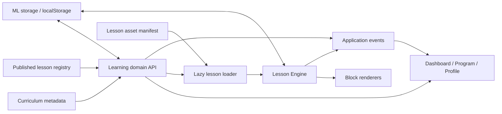

# GEOMAT

Geomat is a local-first mathematics learning application for Russian- and Kazakh-speaking school students. It brings structured Algebra and Geometry lessons, interactive practice, and progress tracking into a static browser application.

[Live Demo](https://geomat.vercel.app) · [Repository](https://github.com/Nurr201/geomat)

## Overview

Geomat covers a curriculum for grades 7–9 and turns published topics into guided, resumable lessons. Students can browse the programme, work through mathematical and visual exercises, and review their progress from the dashboard and learning journal.

The application has no backend: profiles, lesson sessions, results, and settings are stored in the browser.

## Features

- Structured Algebra and Geometry curriculum organised by subject, unit, topic, and lesson
- Config-driven interactive lessons with explanations, guided practice, hints, and feedback
- Mathematical response input powered by a vendored MathLive build
- Interactive linear graphs, equation steps, and SVG geometry activities
- Interactive landing demos for triangle geometry, linear functions, and lesson flow
- Resumable lesson sessions, progress tracking, recent activity, and learning history
- Dashboard, full programme view, local profile, and settings
- Russian and Kazakh interface and lesson content
- Local-first persistence with JSON export and lazy-loaded lesson assets

## Architecture

Curriculum metadata is kept separate from runnable lesson content. The learning layer combines the canonical catalogue, published lesson registry, and saved state for use across the application.



- **Curriculum** — defines canonical subjects, units, topics, lesson order, prerequisites, and production status.
- **Learning** — exposes progress-aware curriculum data, completion operations, and next-lesson selection.
- **Storage** — persists profiles, sessions, results, activity, and settings under `mathlogic_data`.
- **Lesson Loader** — resolves canonical lesson routes and loads only the required config and runtime assets.
- **Lesson Engine** — manages lesson navigation, assessment state, persistence, lifecycle hooks, and completion.
- **Lesson Blocks** — provide reusable math response, guided practice, equation, graph, and geometry interactions.
- **Events & UI** — connect learning state to the dashboard, programme, lesson, and profile pages.

## Tech Stack

HTML5 · CSS3 · Vanilla JavaScript · [MathLive](https://mathlive.io/) · SVG · `localStorage` · Node.js tests

## Project Structure

```text
geomat/
├── data/                 # Curriculum metadata and lesson configurations
├── js/
│   ├── learning.js       # Learning-domain API
│   ├── storage.js        # Browser persistence and migrations
│   ├── lesson-loader.js  # Route-aware asset loading
│   ├── home.js           # Interactive landing-page demos
│   ├── dashboard-data.js # Dashboard learning-context view model
│   ├── lesson-engine/    # Lesson runtime and state
│   └── lesson-blocks/    # Interactive lesson primitives
├── css/                  # Shared and page-specific styles
├── docs/                 # Architecture and lesson authoring documentation
├── tests/                # Integrity, smoke, and interaction tests
├── index.html            # Interactive public landing page
├── dashboard.html
├── program.html
├── lesson.html
└── profile.html
```

## Getting Started

```sh
git clone https://github.com/Nurr201/geomat.git
cd geomat
python3 -m http.server 8000
```

Open [http://localhost:8000](http://localhost:8000). No dependency installation or build step is required.

Run all tests with:

```sh
for test in tests/*.js; do node "$test" || exit 1; done
```

## Status & Roadmap

The curriculum currently contains **169 lesson records** across 28 units and 65 topics. Of these, **36 are implemented**, **4 are reference implementations**, and **129 are planned**. Published content is concentrated in grade 7, with one grade 8 Vieta lesson.

The project currently uses browser-local persistence and has no backend or account synchronization. Prerequisites are represented in curriculum metadata, but published lessons are not yet blocked when a prerequisite is incomplete.

- [x] Canonical curriculum and programme architecture
- [x] Reusable Lesson Engine with resumable sessions
- [x] Math input, equation, graph, and geometry primitives
- [x] Russian and Kazakh localization
- [ ] Complete the remaining curriculum lessons
- [ ] Enforce prerequisite-based lesson availability
- [ ] Continue responsive, accessibility, and bilingual visual QA

## Documentation

- [Learning Architecture](docs/LEARNING_ARCHITECTURE.md)
- [Lesson Engine API](docs/LESSON_ENGINE_API.md)
- [Lesson Authoring Guide](docs/LESSON_AUTHORING_GUIDE.md)

## Author

Nurr

GitHub: [@Nurr201](https://github.com/Nurr201)
